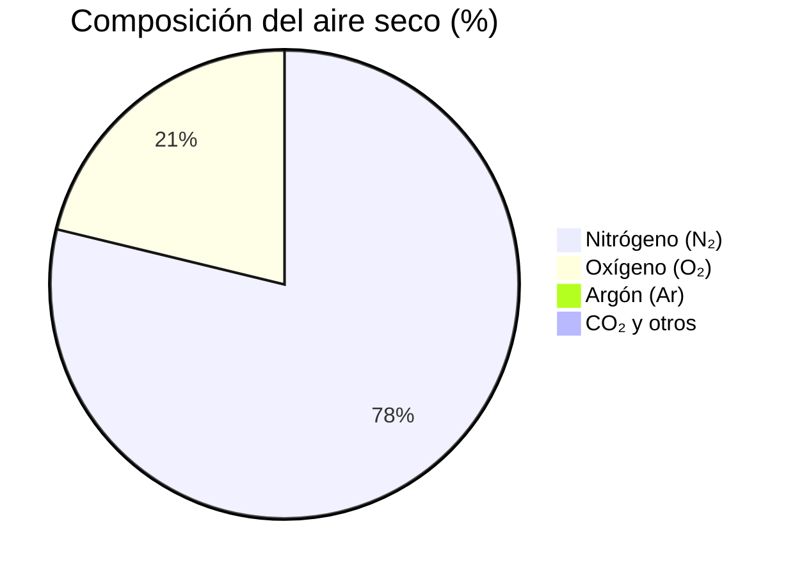
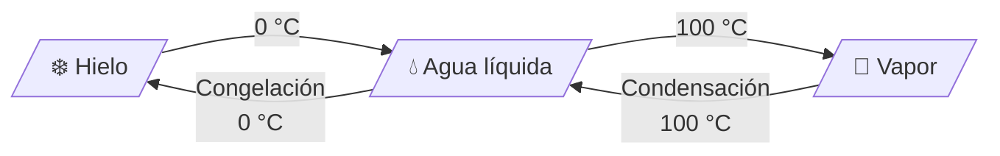

# 📊 Gráficos y Datos

Ejemplos de gráficos interactivos generados con **Mermaid**. Se ven tanto en Obsidian como en la web.

---

## Puntos de fusión y ebullición de hidrocarburos

Comparativa de los primeros cuatro [[02-Química Orgánica/Hidrocarburos|alcanos]]:

```mermaid
xychart-beta
    title "Puntos de fusión y ebullición (°C)"
    x-axis ["Metano (CH₄)", "Etano (C₂H₆)", "Propano (C₃H₈)", "Butano (C₄H₁₀)"]
    y-axis "Temperatura °C" -200 --> 50
    bar [-183, -172, -188, -138]
    bar [-161, -89, -42, -0.5]
```

🔵 Azul = punto de fusión | 🟠 Naranja = punto de ebullición

A más carbonos, más sube el punto de ebullición. El punto de fusión no sigue un patrón tan lineal.

---

## Composición del aire seco

Fuente: composición atmosférica estándar a nivel del mar.

---

## Estados del agua según temperatura

A 1 atmósfera de presión. A mayor altitud (menor presión), el agua hierve a menor temperatura.

> 📖 **Ver también:** [[04-Termodinámica/Entalpía]], [[02-Química Orgánica/Hidrocarburos]]
