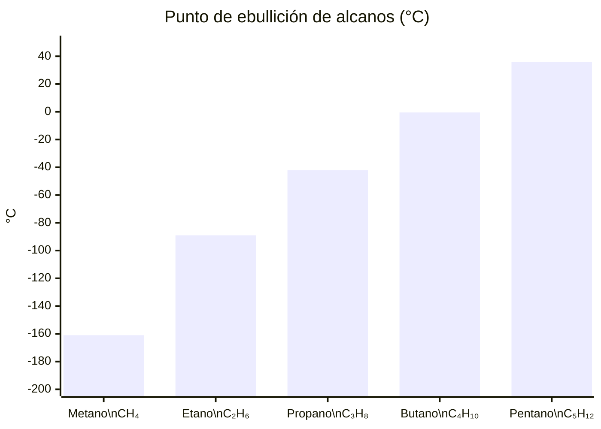
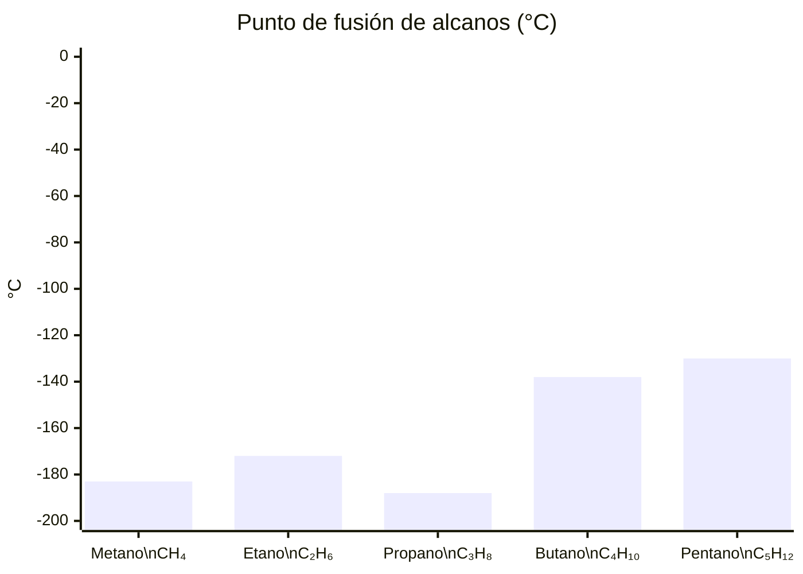
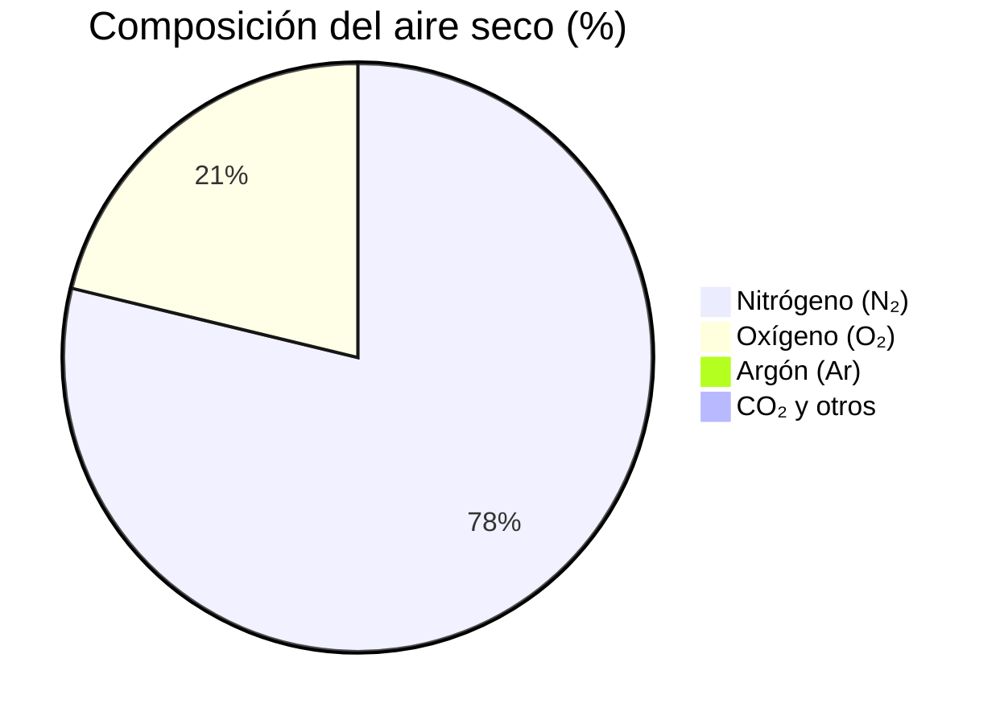
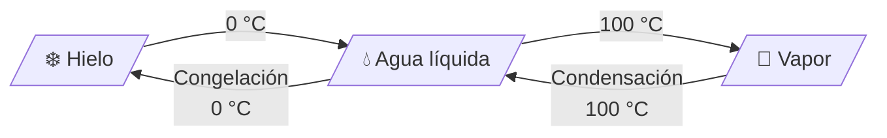

# 📊 Gráficos y Datos

Ejemplos de gráficos generados con **Mermaid**. Se ven tanto en Obsidian como en la web.

---

## Puntos de ebullición de hidrocarburos

A más carbonos, más temperatura necesitas para hervir el compuesto:

---

## Puntos de fusión de hidrocarburos

El punto de fusión también sube con el tamaño, pero con altibajos:

El propano (C₃H₈) rompe la tendencia: funde a -188 °C, más bajo que el etano. Los alcanos con número impar de carbonos se empaquetan peor en estado sólido.

---

## Composición del aire seco

Fuente: composición atmosférica estándar a nivel del mar.

---

## Estados del agua según temperatura

A 1 atmósfera de presión. A mayor altitud (menor presión), el agua hierve a menor temperatura.

> 📖 **Ver también:** [[04-Termodinámica/Entalpía]], [[02-Química Orgánica/Hidrocarburos]]
